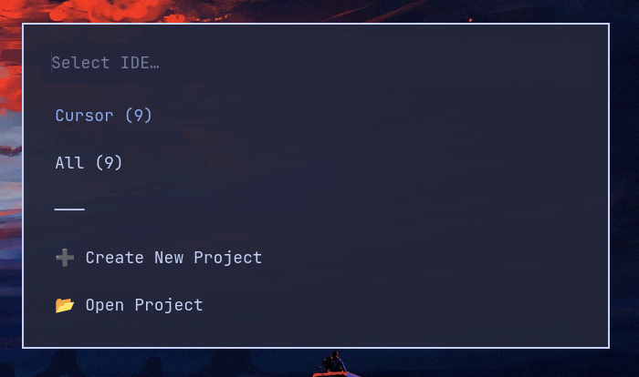

# IDE Projects Menu

A lightweight launcher to quickly open recent IDE projects (Cursor, VS Code, VS Code OSS, VSCodium & Zed) using a dmenu-style menu.

**Fork additions:** Integrated into Walker launcher as a native module instead of separate keybinds.

## Features

- Lists all your IDE workspaces sorted by **most recently used**
- Supports multiple editors: **Cursor**, **VS Code**, **VSCodium**  and **Zed**
- Tabbed interface to filter by IDE
- Shows which editor each project belongs to when viewing all projects
- Fuzzy search through project names
- One-click launch into the appropriate editor
- **Create new projects** - Create a new project directory and open it in your preferred editor
- **Open existing projects** - Browse and open any folder, even if it was never opened in an IDE before

## Screenshots

### IDE Selection Menu


### Project List (Cursor)


## Requirements

- Bash 4.0+ (for case conversion)
- [jq](https://stedolan.github.io/jq/) (optional, for better JSON parsing - falls back to grep/sed if not available)
- [sqlite3](https://www.sqlite.org/) (required for Zed support)
- [Walker](https://github.com/abenz1267/walker) (or any dmenu-compatible launcher)
- At least one of: [Cursor](https://cursor.sh/), [VS Code](https://code.visualstudio.com/), [VSCodium](https://vscodium.com/), or [Zed](https://zed.dev/)

## Installation

```bash
mkdir -p ~/.config/hypr/scripts && \
git clone https://github.com/Airbus6804/Omarchy-Cursor-Projects-Menu.git ~/.config/hypr/scripts/Omarchy-Code-Projects-Menu && \
chmod +x ~/.config/hypr/scripts/Omarchy-Code-Projects-Menu/projects-menu.sh && \
chmod +x ~/.config/hypr/scripts/Omarchy-Code-Projects-Menu/create-project.sh
```

### Walker Integration (Recommended)

Add Projects as an entry in Walker launcher:

```bash
cp ~/.config/hypr/scripts/Omarchy-Code-Projects-Menu/projects.desktop ~/.local/share/applications/
```

Now "Projects" will appear in Walker (SUPER + SPACE). Just type "Projects" and hit Enter to access all your recent projects.

### Alternative: Keybind Setup

Add binds in your Hyprland config:

```
# All IDE projects (shows tabbed interface)
bindd = SUPER SHIFT, P, IDE Projects, exec, ~/.config/hypr/scripts/Omarchy-Code-Projects-Menu/projects-menu.sh

# Direct filter by editor
bindd = SUPER SHIFT, C, Cursor Projects, exec, ~/.config/hypr/scripts/Omarchy-Code-Projects-Menu/projects-menu.sh cursor
bindd = SUPER SHIFT, V, VS Code Projects, exec, ~/.config/hypr/scripts/Omarchy-Code-Projects-Menu/projects-menu.sh code
```

## Usage

### Show tabbed interface (select IDE first)
```bash
./projects-menu.sh
```

When you run the script, you'll see a menu with:
- Your installed IDEs (with project counts)
- **➕ Create New Project** - Create a new project directory
- **📂 Open Folder** - Open any project folder in your file manager

### Filter by specific editor
```bash
./projects-menu.sh cursor    # Cursor only
./projects-menu.sh code       # VS Code only
./projects-menu.sh codium     # VSCodium only
```

## How It Works

### Opening Recent Projects
1. `projects-menu.sh` reads workspace storage from all supported editors using pure bash
2. Extracts project paths and sorts them by modification time (newest first)
3. Shows a tabbed interface to select IDE, then lists projects
4. Opens the selected project in the appropriate editor (automatically detected)

### Creating New Projects
- Prompts for project name and location
- Suggests commonly used project directories based on your history
- Creates the directory structure and opens it in your selected editor

### Opening Folders
- Shows a simple list of folders from your Projects directory
- Opens selected folder in your default file manager
- Quick access to any project folder without opening an IDE

**Note:** This project uses pure bash with standard Linux utilities. No Node.js required! JSON parsing uses `jq` if available, otherwise falls back to `grep`/`sed` for simple extraction.

## Contribution

Contributions are welcome! If you have ideas for improvements or bug fixes, feel free to submit a pull request.

## Credits

Special thanks to [tomkyriacou64](https://github.com/tomkyriacou64) for dropping nodejs dependency, create add project functionality and extending this to support multiple IDEs.
